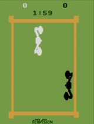
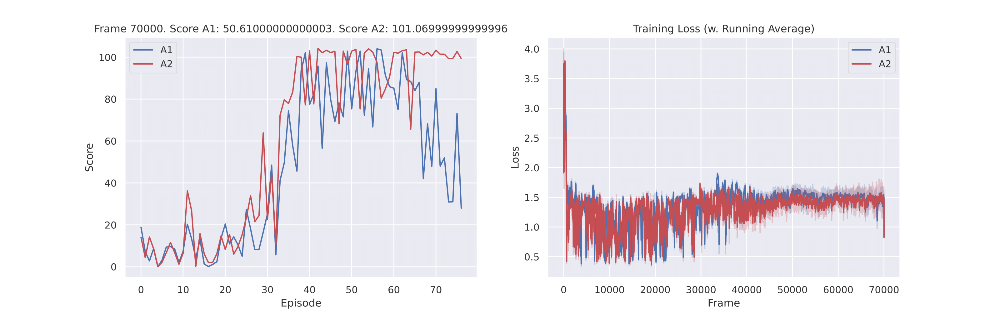
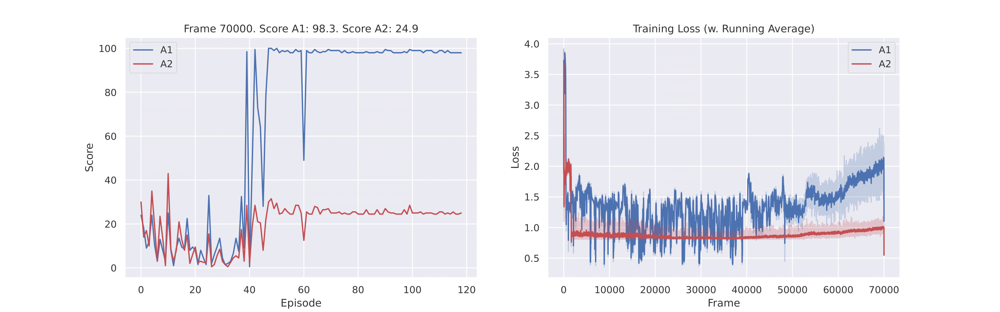
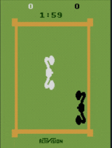
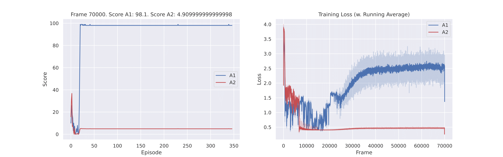

# DQN-Multiagent-ATARI-Boxing

This project employed deep Q-learning to train two agents in a competitive scenario within the domain of multi-agent reinforcement learning, specifically focusing on the ATARI Boxing environment. The architecture was inspired by the [Rainbow](https://arxiv.org/abs/1710.02298) model, adapted from the [Rainbow is All You Need Github](https://github.com/Curt-Park/rainbow-is-all-you-need). The borrowed architecture was modified for a multi-agent domain, introducing enhancements such as transitioning from fully connected layers to convolutional layers for feature extraction. The project systematically explores different choices of hyperparameters and network architectures by allowing agents to compete against each other with these variations.

#### Observations:
  - Environment images were downscaled to grayscale, forming 28x28-pixel representations
  - Observations were constructed by stacking four images together.

### Rewards:
  - The rewards system was altered to assign a small positive reward for receiving a hit and a substantial positive reward for delivering a hit. This adjustment significantly speeded convergence, as the agents became more actively engaged in the fight.

### Implemented Comparisons:

1. **Feature Extraction Enhancement**: Assessed the influence on learning and adaptation by increasing the number of features (64 features) extracted using 2 convolutions for one agent (*A2*) while keeping the other agent's (*A1*) number of features after the convolutions at 32.

2. **Stochastic Elements**: Introduced stochastic decision-making for one agent (*A1*) through noisy fully connected layers. Simultaneously, employed an exponentially-decaying epsilon scheduler for the other agent (*A2*) to manage exploration-exploitation trade-offs.

3. **Replay Buffer Prefilling**: Evaluated the impact on learning dynamics and overall performance by prefilling the replay buffer for one agent (*A1*) while leaving it empty for the other (*A2*). The replay buffer of size 6000 was filled to 80% of its capacity for the first agent and 0% for the second agent.

### Results:

The agent indicated as *A1* is represented by a white agent, while *A2* is visualized as a black agent in the provided GIFs.

| Comparison               | Final Learned Models               |  Learning Plots              |
| ---------------------- | ---------------------- | ---------------------- |
| 1. Feature Extraction Enhancement              |  |  |
| 2. Stochastic Elements                |  | | 
| 3. Replay Buffer Prefilling                |  |  |

## Conclusion

The first comparison shows that employing more features (64) leads to superior long-term performance, enabling faster learning of a more rewarding policy. The second comparison establishes the superiority of noisy layers over the epsilon-greedy algorithm, confirming findings in [Noisy Nets](https://arxiv.org/abs/1706.10295). The third experiment demonstrates that prefilling the replay buffer with random actions accelerates convergence, establishing the superiority of a learned policy through a cascading effect of adverse experiences for the other agent.

## Installation
```console
pip install -r requirements.txt
```

Ensure you followed the instructions for ROM installation outlined [here](https://pettingzoo.farama.org/environments/atari/#installation). Note that you may need to downgrade Python to version 3.8.18 for compatibility.

Feel free to contribute, provide feedback, or report issues to enhance the project collaboratively.

#### Collaboration Note:
The project was conducted in collaboration with [AnaTeodoraR](https://github.com/AnaTeodoraR).
