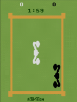

# DQN-Multiagent-ATARI-Boxing
Project that teaches 2 agents box each other.

## Experimenting with Architectures:

The following comparisons were inspected: 

  1. Replay Buffer Prefilling: Prefill the replay buffer for one agent while leaving it empty for the other. Evaluate the impact on learning dynamics and overall performance.

  2. Feature Extraction Enhancement: Increase the number of features extracted using convolutions for one agent, keeping the other agent's feature extraction unchanged. Assess how this modification influences the agents' ability to learn and adapt.

  3. Stochastic Elements: Introduce noisy layers for one agent to add a level of stochasticity in its decision-making process. Simultaneously, employ an epsilon scheduler for the other agent to control exploration-exploitation trade-offs.


| Comparison               | Final learned models               |  Learning plots              |
| ---------------------- | ---------------------- | ---------------------- |
| eps vs noisy                |  |  |

## Installation
```console
pip install -r requirements.txt
```
Installation of ROMs: https://pettingzoo.farama.org/environments/atari/#installation

Note: You might have to downgrade Python to 3.8.18.
